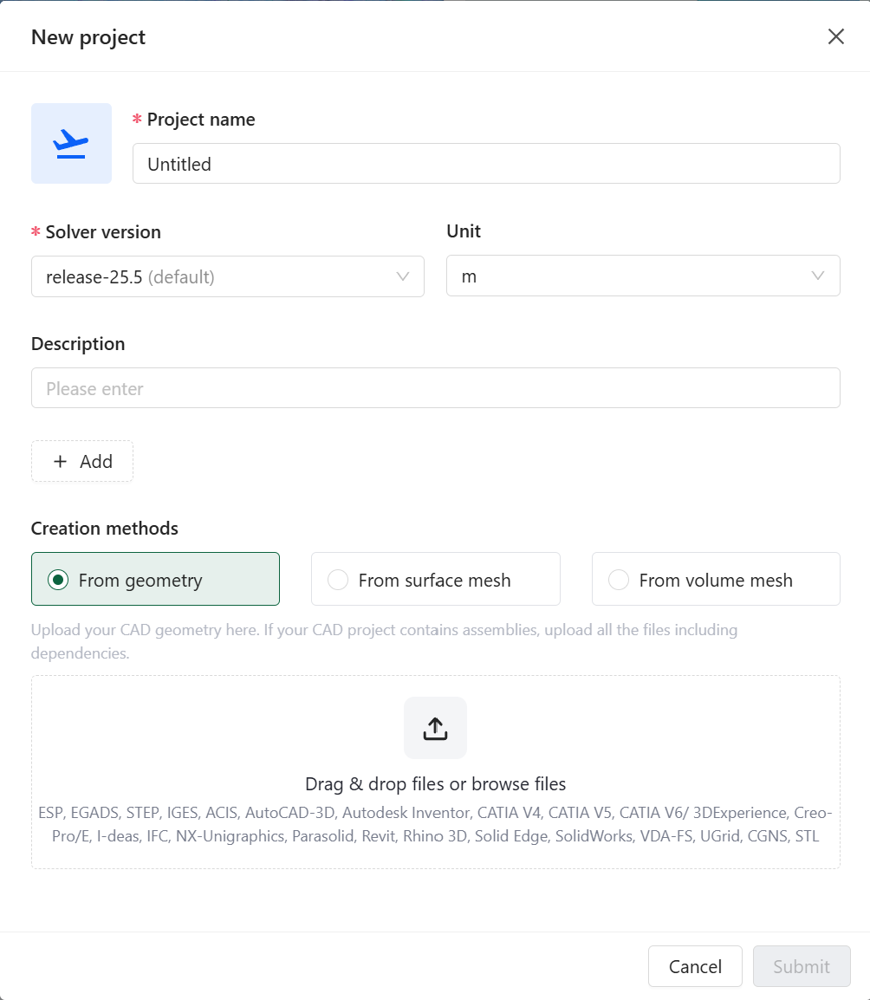

# Starting Project

*This document describes how to start a project in Flow360 GUI.*

## 📝 **New Project**

*The New Project window is the entry point for creating CFD simulations in Flow360. It allows users to choose between geometry-based or mesh-based workflows.*

<p align="center">
  
</p>

---

## 📋 **Available Options**

| *Option*           | *Description*                                               | *Default*                |
|--------------------|------------------------------------------------------------|--------------------------|
| **Project name**   | Unique identifier for your simulation project               | `Untitled`               |
| **Solver version** | Flow360 solver release version                             | Latest stable release    |
| **Unit**           | Physical unit for the geometry/mesh                        | `m` (meter)              |
| **Description**    | Optional project description and notes                     | Empty                    |
| **Creation method**| Method for creating the simulation (from geometry/from surface mesh/from volume mesh) | `From geometry`   |

---

## 🔍 **Detailed Descriptions**

### **Project name**

*Unique name that identifies your simulation project in the Flow360 system.*

- **Default:** `Untitled`
- **Example:** `Wing_Analysis_M08`
- **Notes:** Choose a descriptive name that helps identify the project purpose.

### **Solver version**

*Specifies the Flow360 solver version to be used for the simulation.*

- **Default:** Latest stable release
- **Example:** `release-24.11`
- **Notes:** It's recommended to use the latest stable release unless specific version compatibility is required.

### **Unit**

*Defines the physical unit for interpreting mesh/geometry dimensions.*

- **Default:** `m` (meter)
- **Example:** `inch`
- **Note:** Ensure this matches the units used in your CAD or mesh file to avoid scaling issues.

### **Description**

*Optional field for adding project notes, objectives, or other relevant information.*

- **Default:** Empty
- **Example:** `High-lift configuration analysis at takeoff conditions`
- **Note:** Below the description field you can add tags to your project by clicking the `+ Add` icon.

### **Creation methods**

*Choose how to initialize your project.*

- **From geometry:** The uploaded CAD geometry becomes a root of the project. It is necessary to run surface meshing and volume meshing steps before launching the simulation.
  - **Supported formats:** ESP, EGADS, STEP, IGES, ACIS, AutoCAD-3D, Autodesk Inventor, CATIA V4-V6, Creo-Pro/E, I-deas, IFC, NX-Unigraphics, Parasolid, Revit, Rhino 3D, Solid Edge, SolidWorks, VDA-FS, UGrid, CGNS, STL
  - **Requirements:**
    - Clean, watertight geometry
    - Properly defined assemblies with all dependencies
- **From surface mesh:** Use a pre-generated surface mesh file as a root of the project. It is necessary to run volume meshing before launching the simulation.
  - **Supported formats:** UGrid, CGNS, STL
  - **Requirements:**
    - Valid surface mesh 
    - Triangular elements

- **From volume mesh:** Use a pre-generated volume mesh file as a root of the project. By using this method, the case does not need any additional pre-processing and is ready for running.
  - **Supported formats:** UGrid, CGNS
  - **Requirements:**
    - Valid volume mesh
    - Acceptable element types:
      - Tetrahedrons
      - Hexahedrons
      - Prisms
      - Pyramids

---

<details>
<summary><h3 style="display:inline-block"> 💡 Tips</h3></summary>

- Choose a descriptive project name for easier identification.
- Ensure the unit matches your CAD or mesh file to avoid scaling issues.
- Use the description field to add notes or objectives for future reference.
- Add tags to your project for better organization.

</details>

---

<details>
<summary><h3 style="display:inline-block"> ❓ Frequently Asked Questions</h3></summary>

- **What happens if my geometry has multiple parts?**
  > For assemblies, upload all required files including dependencies. The system will maintain the assembly structure.

- **Can I change the project unit after project creation?**
  > No, the project unit cannot be changed after project creation. Ensure correct units are selected initially. Keep in mind that this does not affect units assigned during simulation setup.

- **What if my CAD format is not listed?**
  > Consider converting your geometry to one of the supported formats using CAD translation software.

- **Do you have to upload the surface mesh with the farfield?**
  > No, you can upload the surface mesh of the object you want to simulate and use the [Automatic Farfield](../02.simulation-setup/01.flow-conditions/02.farfield.md) option. You can also upload your custom farfield as part of the surface mesh file.

</details>

---

<details>
<summary><h3 style="display:inline-block"> 🐍 Python Example Usage</h3></summary>

Below is a Python code example showing how to create a new project programmatically:

```python
import flow360 as fl

# Create a new project from geometry
geo_project = fl.Project.from_geometry("my_geometry.csm", "Project from geometry", length_unit=fl.u.m)

# Create a new project from surface mesh
sm_project = fl.Project.from_surface_mesh("my_surface_mesh.stl", "Project from surface mesh", length_unit=fl.u.inch)

# Create a new project from volume mesh
vm_project = fl.Project.from_volume_mesh("my_volume_mesh.cgns", "Project from volume mesh", length_unit=fl.u.mm)
```

</details>