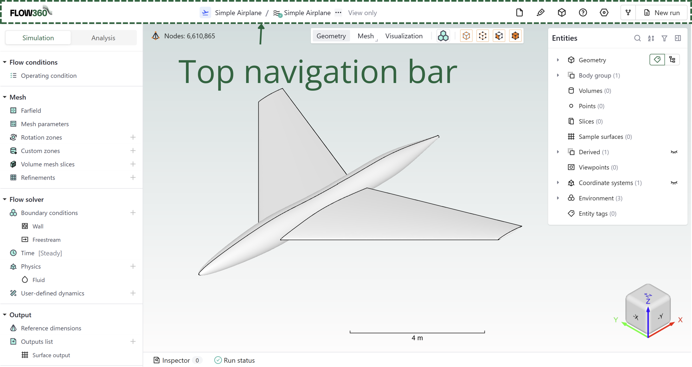

# Top Bar

*The Flow360 GUI top bar provides essential navigation and project management functionality, enabling efficient workflow control and access to key features.*

---

## **Available Components** (from left to right)

| *Component*         | *Icon*      | *Description*                                                                 |
|---------------------|-------------|-------------------------------------------------------------------------------|
| **Flow360 logo**    |  | Return to Flow360 Dashboard                                      |
| **Project tree**    |  | Hierarchical view of project components. See [Project tree](../05.project-tree.md) |
| **More**            |  | Export/import settings via three-dot menu                                     |
| **View only**       |  | Indicates view-only mode for the project                        |
| **Assets**          |  | Access project assets and resources                                 |
| **Resource**        |  | Import geometry resources (Geometry AI only) and sample surfaces                   |
| **Probe**           |  | Show location of entered coordinates or show coordinates of a clicked location                  |
| **Help**            |  | Access documentation and support                                         |
| **Settings**        |  | Access to project and variable settings               |
| **Fork/New run**    |  | Create project variants                                 |

---

## **Detailed Descriptions**

### **Flow360 logo**

*Quick access to return to the Flow360 Dashboard, maintaining efficient workflow navigation.*

### **Project tree**

*Hierarchical organization of project components, providing structured access to simulation elements.*

- Expandable/collapsible structure
- Visual status indicators
- Direct component access
- See [Project tree](../05.project-tree.md) for more details

### **More**

*Additional project management options accessible via a three-dot menu.*

- Import/Export simulation settings
- Import/Export viewpoints

### **View only**

*Notification that the project is currently being viewed in view-only mode.*

- Simulation parameters cannot be changed in this mode
- To exit, click on New run or select a component from the project tree

### **Assets**

 *Central repository for project-related resources and files.*

- Information about each asset
- Downloadable files list for each asset

### **Resource**

 *Import geometry resources and sample surfaces.*

- **Geometry resource**: Import additional geometry files (Geometry AI only)
- **Sample surface**: Import sample surface data

### **Probe**

 *Show location of entered coordinates or show coordinates of a clicked location.*

- Enter coordinates to highlight a location in the viewer
- Click on geometry to display coordinates of that point

### **Help**

 *Access to documentation, support resources, and guidance materials.*

### **Project settings**

 *Configuration interface for project-specific parameters. Includes run settings and project details.*

### **Fork/New run**

 *Create an extension of a case based on current configuration.*

- See [Forking section](../05.project-tree.md#forking) in the [Project tree](../05.project-tree.md) documentation for more information.

---

<h3 style="display:inline-block"> 💡 Tips</h3>

- Use keyboard shortcuts for frequent operations
- Regularly save project settings
- Monitor view-only status when collaborating
- Utilize project tree for quick navigation
- Keep asset organization structured

---

<h3 style="display:inline-block"> ❓ Frequently Asked Questions</h3>

- **How do I return to the dashboard?**
  > Click the left-most navigation icon in the top bar.

- **Can I customize the project tree view?**
  > Yes, use the project tree settings to adjust the display and organization of components.

- **What's the difference between Fork and New Run?**
  > Fork creates a new project variant with modifiable settings, while New Run creates another simulation with the same configuration.

- **How do I share view-only access?**
  > Enable view-only mode and share the project URL with collaborators.

