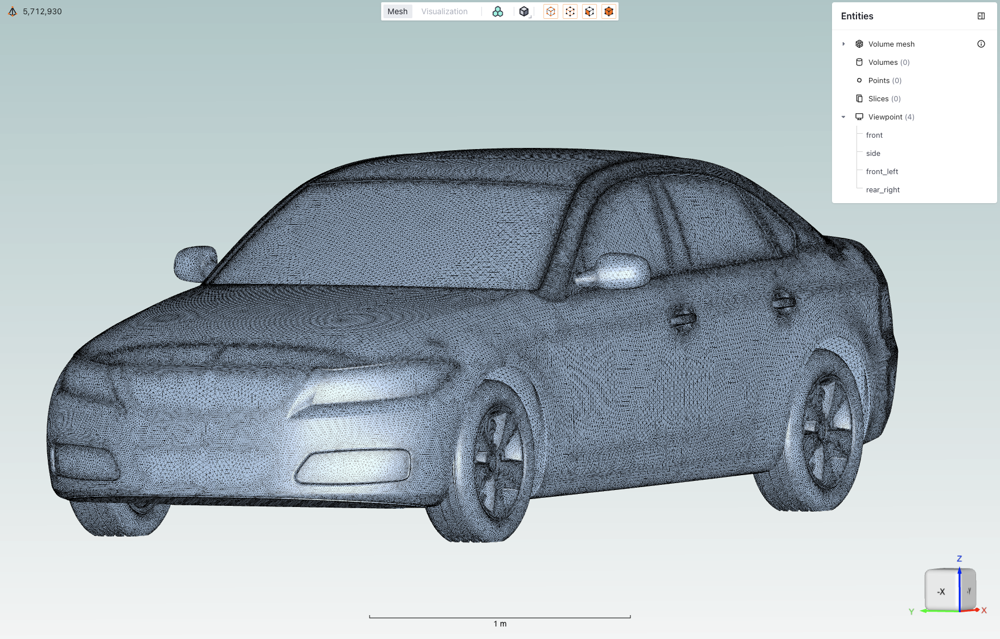
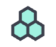
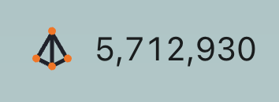
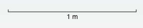

# Viewer Region

*The viewer region is the primary visualization interface in Flow360 GUI, providing interactive 3D visualization capabilities for geometry inspection, mesh analysis, and results visualization.*

## Example Views

### Geometry View Mode

*Example of the geometry view mode showing a CAD model with entity selection panel.*

### Mesh View Mode

*Example of the mesh view mode displaying a mesh visualization.*

## Core Features

| *Feature*                | *Icon*                                                                                                   | *Description*                                                                                      |
|----------------------------|------------------------------------------------------------------------------------------------------------|------------------------------------------------------------------------------------------------------|
| **View modes**             |                                                            | Toggle between Geometry, Mesh, and Visualization views                                               |
| **Boundary conditions**    |                                                   | Toggle coloring of boundaries based on their assigned boundary condition                              |
| **Diagnostic tools**       |                                                         | Geometry quality inspection features                                                                 |
| **Mesh display**           |   | Mesh display options: solid or solid with edges                                                      |
| **Entity selection mode**  |                                                         | Tools for selecting and managing geometry entities                                                   |
| **Entities visibility**    |                                                   | Toggle the visibility of entities by clicking the eye icon when hovering over them                   |
| **Mesh metrics**           |                                                                 | Expand the mesh metrics view by clicking on the icon when in mesh view                               |
| **Viewpoints**             |                                                                       | Controls for saving and loading specific camera positions                                            |
| **Length scale indicator** |                                                                 | Visual reference showing model dimensions to help maintain perspective                               |
| **Rotation cube**          |                                                               | Interactive orientation widget for quick view rotation to standard angles                            |

---

## Detailed Descriptions

### View modes

*Toggle between Geometry/Mesh/Visualization views using top toolbar tabs.*

- **Geometry:** View CAD geometry
- **Mesh:** Inspect surface and volume mesh
- **Visualization:** View simulation results and post-processing

>**Note:** Each mode provides context-specific tools and options.

### Boundary conditions

*Toggle coloring of boundaries based on their assigned boundary condition.*

>**Note:** Helps verify boundary condition assignments before mesh generation.

### Diagnostic tools

*Tools for geometry quality inspection and validation that color areas of geometry depending on their level of confidence.*

### Mesh display

*Control the visualization of mesh elements and their properties. Can be  set as either solid or solid with edges.*

### Entity selection mode

*Tools for selecting and managing geometry entities.*

| **Entity Type** | **Icon** | **Description** |
|-----------------|----------|-----------------|
| Points |  | Select individual points/vertices |
| Edges |  | Select edge elements |
| Faces |  | Select face/surface elements |
| Volumes |  | Select volume elements |

>**Note:** You can use any combination of selection modes.

### Entities visibility

*Toggle the visibility of entities by clicking the eye icon when hovering over them.*

### Mesh metrics

*Quantitative mesh quality assessment tools for analyzing both surface and volume mesh characteristics.*

### Element types overview

The mesh quality visualization provides statistics for different element types commonly found in CFD meshes:

Nodes are present in every mesh and represent the intersection points of mesh elements, they are fundamental to defining the mesh structure and geometry.

- **Surface Elements:**
  - Triangles: Primary surface mesh elements
  - Quadrilaterals: Optional structured surface elements

- **Volume Elements:**
  - Tetrahedrons: Unstructured volume elements
  - Prisms: Boundary layer elements
  - Pyramids: Transition elements between different element types
  - Hexahedrons: Structured volume elements

- **Surface metrics**

  *Key metrics for assessing surface mesh quality:*

  | *Metric* | *Description* | *Importance* |
  |--------|-------------|------------|
  | **Area** | Face area of surface elements | Identifies areas of highly non-uniform mesh resolution |
  | **Area Ratio** | Ratio between adjacent face areas | Indicates mesh growth rate and smoothness |
  | **Aspect Ratio** | Ratio between longest and shortest edge | Measures element skewness and potential numerical issues |
  | **First Layer Height** | Height of first prismatic layer | Critical for boundary layer resolution |

- **Volume metrics**

  *Essential metrics for volume mesh quality assessment:*

  | *Metric* | *Description* | *Importance* |
  |--------|-------------|------------|
  | **Aspect Ratio** | Element shape quality indicator | Identifies highly stretched or compressed elements |
  | **Volume** | Element volume measurement | Helps detect very small or large elements that might affect solution stability |

### Viewpoints

*Controls for saving and loading specific camera positions.*

- **Usage:**
  - Click the + icon to add a new viewpoint that will be the current camera position
  - Name the viewpoint to be representative of the camera position

### Length scale indicator

*Visual reference showing model dimensions to help maintain perspective.*

- **Features:**
  - Dynamic scale adjustment
  - Unit system consistency
  - Reference dimension display

### Rotation cube

*Interactive orientation widget for quick view rotation to standard angles.*

- **Usage:**
  - Click cube faces for orthogonal views
  - Click vertices or edges for isometric views

---

<h3 style="display:inline-block"> 💡 Tips</h3>

- Use keyboard shortcuts (Ctrl/Cmd) with mouse operations for enhanced control
- Save frequently used viewpoints for quick access
- Customize entity visibility to focus on areas of interest
- Use the fit-to-view option when navigating large models

---

<h3 style="display:inline-block"> ❓ Frequently Asked Questions</h3>

- **How can I reset the view if I get disoriented?**
  > Use the "Fit to Screen" option in the view menu.

- **Why can't I select certain entities?**
  > Verify that the correct entity type is enabled in the selection toolbar.

- **How do I save a custom viewpoint?**
  > Use the "Save Viewpoint" option in the View context menu after positioning the view as desired.

