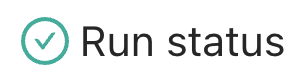
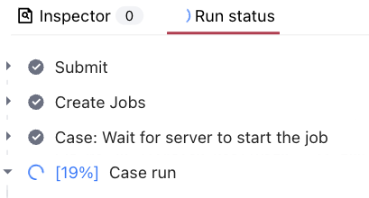

# 📊 **Status Bar**

*The Status Bar at the bottom of the screen provides real-time information about simulation parameters and execution progress. It consists of two main components: the Inspector and Run Status panels.*

---

## 📋 **Available Components**

| **Component** | **Icon** | **Description** |
|--------------|-------------------|----------------------------------------------------------------|
| **Inspector**  |  | Displays and validates required simulation parameters |
| **Run Status** |  | Shows simulation progress, job status, and execution information |
---

## 🔍 **Detailed Descriptions**

### **Inspector**

*The Inspector panel validates and displays essential simulation parameters that must be defined or corrected before running the simulation.*

  

>**Important:** A simulation cannot be started until all required fields are filled and all errors are resolved (Inspector shows 0).

The Inspector provides comprehensive validation feedback:

- Required fields (orange): Shows count of missing required parameters
- Error states (red): Indicates validation errors that must be fixed
- Field paths (blue): Links to specific parameters needing attention
- Parameter path (e.g., `[velocity_magnitude]`, `[4/surfaces]`)
- Validation status ("Field required", "Value error")
- Context information ("relevant for: Case")
- Detailed error messages when applicable

### **Run Status**

*The Run Status panel provides a hierarchical view of simulation execution stages and progress.*

  

- **Status Information:**
  - Real-time simulation logs
  - Current execution phase
  - Detailed progress tracking

- **Status Icons and Their Applicability:**
  | Icon | Status | Surface Meshing | Volume Meshing | Case Run |
  |------|---------|-----------------|----------------|-----------|
  |  | Finished | ✓ | ✓ | ✓ |
  |  | Failed | ✓ | ✓ | ✓ |
  |  | Running | ✓ | ✓ | ✓ |
  |  | Diverged | - | - | ✓ |

  >**Note:** The "Diverged" status is specific to case runs only and indicates numerical instability in the simulation.

---

<h3 style="display:inline-block"> 💡 Tips</h3>

- Monitor the Inspector panel for any missing required parameters
- Use the Run Status panel to track simulation progress
- Check simulation logs for detailed execution information
- Pay attention to validation errors in the Inspector panel
- **Remember:** The simulation cannot be started if the Inspector shows an error or a required field.

---

<h3 style="display:inline-block"> ❓ Frequently Asked Questions</h3>

- **What does the percentage in Run Status indicate?**  
  > The percentage shows the current progress of the component run.

- **Why are some fields marked as required?**  
  > Required fields contain essential parameters necessary for the simulation to run correctly.

- **What should I do if the Run Status shows an error?**  
  > Check the simulation logs for detailed error information.

