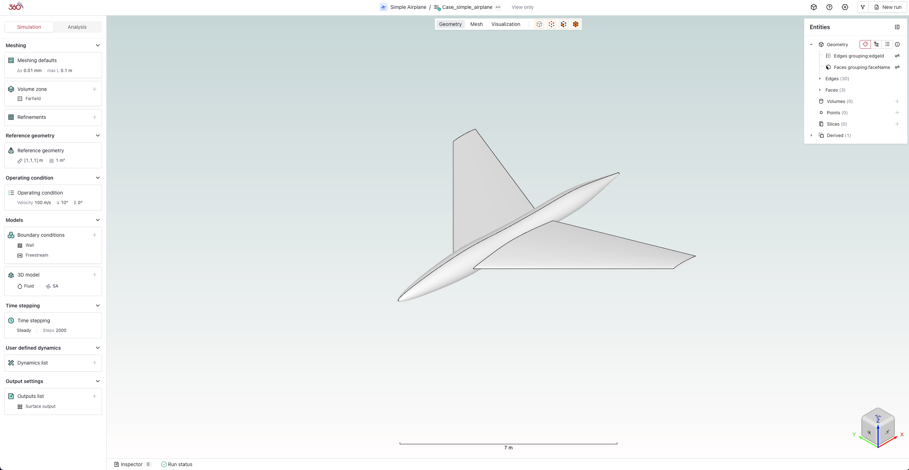

# General Workflow in Flow360 GUI

*This document outlines the systematic approach to setting up and running CFD simulations using the Flow360 graphical user interface.*

---
## 🛠️ **Workbench view**

For workbench layout, refer to this [page](./03.workbench-layout.md).

---

### 📋 **Primary Workflow Steps**

| **Step** | **Description** | **Location** |
|----------|----------------|--------------|
| `Setup` | Configure simulation parameters | Simulation tab |
| `Verify` | Verify setup using inspector | Bottom status bar |
| `Run` | Initiate simulation run | Top-right corner |
| `Monitor` | Track simulation progress | Analysis tab |
| `Visualize` | View results | Central viewer region |

---

### 🔍 **Detailed Descriptions**

#### `Setup`

*Configure simulation parameters in a top-to-bottom sequence through the left sidebar.*

- **Required Steps:**
  - Meshing configuration (if starting from geometry)
  - Reference geometry definition
  - Operating conditions
  - Models selection
  - Time stepping parameters
  - Output settings
- **Notes:** Parameters are organized in collapsible sections for clarity

#### `Verify`

*Verify simulation setup completeness using the inspector tool.*

- **Location:** Bottom status bar
- **Success Indicator:** Inspector showing 0 errors
- **Notes:** Address any warnings or errors before proceeding

#### `Run`

*Initiate the simulation process including surface and volume meshing.*

- **Location:** Top-right corner "Run" button
- **Scope:** Complete workflow from geometry to solution
- **Notes:** Automated meshing is included when starting from geometry

#### `Monitor`

*Track simulation progress and analyze numerical results.*

- **Access:** "Analysis" tab adjacent to "Simulation"
- **Features:** Real-time convergence monitoring
- **Notes:** Multiple visualization options available

#### `Visualize`

*Inspect mesh and results using the central viewer.*

- **Controls:** Viewer bar for mode selection
- **Options:** Geometry, mesh, and solution visualization
- **Notes:** Interactive 3D viewport with customizable display settings

---

<h3 style="display:inline-block"> 💡 Tips</h3>

- Complete setup sections sequentially from top to bottom
- Use the Entities bar on the right for detailed model inspection
- Save work periodically during setup
- Verify all required fields before execution
- Monitor convergence through the Analysis tab

---

<h3 style="display:inline-block"> ❓ Frequently Asked Questions</h3>

- **What happens if the inspector shows errors?**
  > The simulation cannot be executed until all errors are resolved. Address each error in the setup.

- **Can I modify parameters during simulation?**
  > Most parameters cannot be modified during active simulation. Stop the simulation to make changes.

- **How do I track simulation progress?**
  > Use the Analysis tab to monitor convergence and the bottom status bar for overall progress.

- **Where can I find detailed mesh statistics?**
  > Access mesh details through the Entities browser and mesh visualization options in the central viewer.

