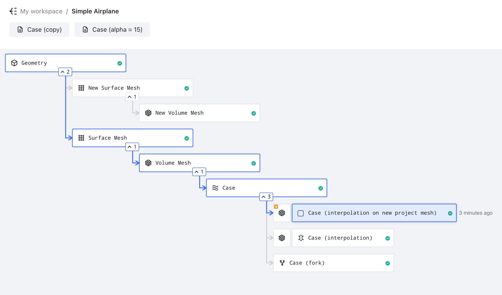
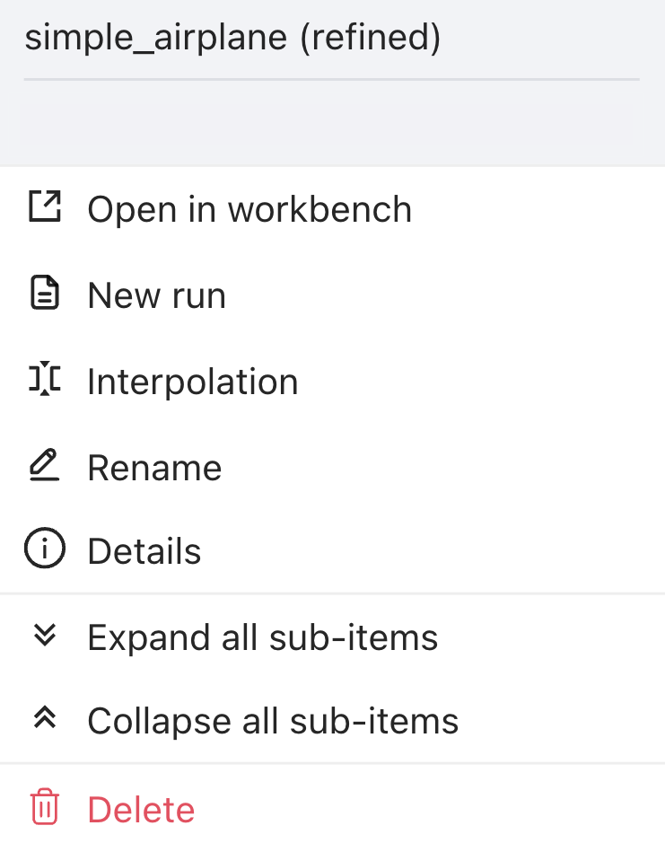

# Project Tree

*The project tree is a hierarchical visualization interface that displays the complete workflow of your CFD simulation, from geometry to final results. It provides an intuitive way to track simulation progress and navigate between different stages of your analysis.* 

>**Note:** The project tree is generated automatically based on your settings and intelligently identifies existing nodes that match your specifications. 
>
>For example, if a surface mesh with identical settings already exists in the project, Flow360 will reuse it rather than generating a duplicate. Similarly, when a case with matching simulation parameters exists, the system will utilize the existing case instead of running a redundant simulation.

<div align="center">
  
</div>

---

## 🔍 **Icon Explanation**

| *Icon* | *Name* | *Description* |
|----------|----------|-----------------|
|  | Geometry | Represents the CAD geometry input for the simulation |
|  | Surface Mesh | Represents the discretized surface of the geometry |
|  | Volume Mesh | Represents the 3D computational mesh used for simulation |
|  | Case | Represents a simulation case with defined parameters |
|  | Fork | Indicates a continuation / branched variant of an existing parent |
|  | Draft | Represents a simulation setup that hasn't been run yet |

---

## 🌳 **Project Structure**

*The Flow360 project structure follows a flexible hierarchical organization that accommodates different starting points and multiple analysis paths. Each node in the tree represents a distinct stage in the simulation process, with the ability to branch and create parallel analysis streams.*

### 🚪 **Entry Points**

The project can be initiated from two different entry points:
1. **Geometry-First Approach**:
   - Starts with CAD geometry
   - Requires the workflow to include surface and volume mesh generation

2. **Mesh-First Approach**:
   - Starts directly with a surface or volume mesh
   - Meshing settings are available only when starting from a surface mesh

### 📊 **Workflow Hierarchy**

The workflow structure depends on the chosen entry point. Below are the two possible progression paths:

#### 1. Starting from geometry
```
Geometry
└── Surface Mesh
    └── Volume Mesh
        └── Case
            └── Fork (optional)
```

#### 2. Starting from surface mesh
```
Surface Mesh
└── Volume Mesh
    └── Case
        └── Fork (optional)
```

#### 3. Starting from volume mesh
```
Volume Mesh
└── Case
    └── Fork (optional)
```

>**Note:** Each node in these hierarchies can branch into multiple parallel paths. For example:
>```
>Geometry
>├── Surface Mesh A
>│   ├── Volume Mesh A1
>│   │   ├── Case A1.1
>│   │   │   └── Fork A1.1.1
>│   │   └── Case A1.2
>│   └── Volume Mesh A2
>│       └── Case A2.1
>└── Surface Mesh B
>    └── Volume Mesh B1
>        └── Case B1.1
>            └── Fork B1.1.1
>```

### 🌿 **Branching Capabilities**

The project tree supports multiple branches at each level:

- **Geometry Level**:
  - Can generate multiple surface meshes
  - Each surface mesh represents different discretization parameters
  - Useful for mesh sensitivity studies

- **Surface Mesh Level**:
  - Multiple volume meshes possible from single surface mesh
  - Supports different volume mesh parameters
  - Enables boundary layer resolution studies

- **Volume Mesh Level**:
  - Can spawn multiple simulation cases
  - Each case can have unique solver settings
  - Facilitates parameter studies

- **Case Level**:
  - Supports forking for continuation runs
  - Forks inherit all case results and settings
  - Allows parameter modifications while preserving history

### ➡️ **Forking**

- Forks are direct extensions of their parent cases
- All results and settings are preserved in forks
- Simulation continues from the last state of the parent case
- Multiple forks can branch from the same parent case

### 🎯 **Component Actions**

When clicking on a component in the project tree, a menu of available actions appears. Below are the available actions:

<div align="center">
  
</div>

| **Action** | **Description** |
|------------|-----------------|
| Open in workbench | Opens the component workbench |
| New run | Creates a new simulation run draft using settings from this component |
| Interpolation | Transfers solution data between different mesh resolutions |
| Rename | Changes the display name of the component |
| Details | Shows components details such as ID, name, cost, parent asset ID, etc. |
| Expand all sub-items | Shows all sub-components derived from this component |
| Collapse all sub-items | Hides all sub-components derived from this component |
| Delete | Removes the component and all its dependent sub-components |

---

<details>
<summary><h3 style="display:inline-block"> 💡 Tips</h3></summary>

- Click on any node to view more options
- Use the expand/collapse arrows to manage tree visibility
- Monitor simulation progress through status indicators
- Connected nodes show workflow dependencies

</details>

---

<details>
<summary><h3 style="display:inline-block"> ❓ Frequently Asked Questions</h3></summary>

- **What do the numbers next to collapse icon (`^`) mean?**
  > The numbers indicate how many branches that particular component has.

- **How can I create a new run of my simulation?**
  > Click on any node and select "New run" to create a new simulation branch with modified parameters.

- **Can I have multiple projects open simultaneously?**
  > Yes, but to do so you will need to have a separate tab open for each project in your browser.

</details>

---

<details>
<summary><h3 style="display:inline-block"> 🐍 Python Example Usage</h3></summary>

Below is a Python code example showing how to create forks:

```python
import flow360 as fl

project = fl.Project.from_cloud(project_id="prj-XXXXX") # Should be a valid project id

# Specify a case you want to fork from
case = fl.Case(id="case-XXXXX") # Should be a valid case id

# Change desired parameters, e.g. time stepping
case.params.time_stepping.step_size = 0.0001
case.params.time_stepping.steps = 1500

# Fork the case
case_fork_1 = project.run_case(case.params, "case-fork-1", fork_from=case)

# Change forked case's parameters
case_fork_1.params.time_stepping.step_size = 0.00005
case_fork_1.params.time_stepping.steps = 2500

# Fork from a fork
case_fork_1 = project.run_case(case_fork_1.params, "case-fork-1", fork_from=case_fork_1)
```

</details>