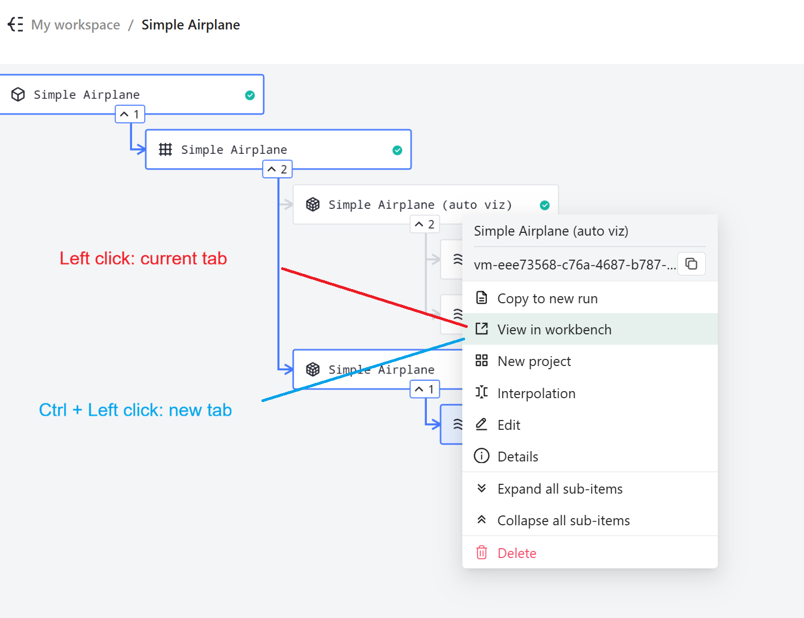

# Keyboard Shortcuts

*Keyboard shortcuts in Flow360 WebUI provide quick access to frequently used actions, improving workflow efficiency and reducing reliance on mouse navigation.*

>**Note:** On macOS, `Ctrl` is replaced with `Command` (Cmd) for all shortcuts.

---

## **Selection**

*Shortcuts for selecting items in the Flow360 Workbench.*

| *Action* | *Windows / Linux* | *macOS* | *Description* |
|----------|-------------------|---------|---------------|
| **Single selection** | `Click` | `Click` | Select a single item |
| **Multiple selection** | `Ctrl + Click` | `Cmd + Click` | Add or remove items from selection |
| **Box selection** | `Shift + Drag` (rectangle) | `Shift + Drag` (rectangle) | Select multiple items by dragging a selection box |
| **Continue to add/remove selections** | `Ctrl + Shift + Drag` (rectangle) | `Cmd + Shift + Drag` (rectangle) | Modify existing selection by dragging a box |
| **Clear selection** | `ESC` | `ESC` | Deselect all currently selected items |

---

## **View**

*Shortcuts for navigating and controlling the 3D viewer.*

| *Action* | *Windows / Linux* | *macOS* | *Description* |
|----------|-------------------|---------|---------------|
| **Move (Pan)** | `Right Mouse Button + Drag` | `Right Mouse Button + Drag` | Pan the view by holding right mouse button and dragging |
| **Rotate** | `Left Mouse Button + Drag` | `Left Mouse Button + Drag` | Rotate the view by holding left mouse button and dragging |
| **Zoom in** | `Mouse Wheel` (scroll up) | `Mouse Wheel` (scroll up) | Zoom in by scrolling mouse wheel forward |
| **Zoom out** | `Mouse Wheel` (scroll down) | `Mouse Wheel` (scroll down) | Zoom out by scrolling mouse wheel backward |
| **Fit view** | `Right click + select from menu` | `Right click + select from menu` | Fit entire model to viewport |
| **Fit selected** | `Right click + select from menu` | `Right click + select from menu` | Fit selected items to viewport |
| **Reset view** | `Right click + select from menu` | `Right click + select from menu` | Reset camera to default view |

---

## **Project Tree**

*Shortcuts for interacting with the project tree hierarchy.*

### **Context Menu Shortcuts**

*Shortcuts for opening actions from the project tree context menu. Only applies to the first four actions in the menu illustrated below.*

| *Action* | *Windows / Linux* | *macOS* | *Description* |
|----------|-------------------|---------|---------------|
| **Open in new tab** | `Ctrl + Left Click` | `Cmd + Left Click` | Open actions in a new tab |
| **Open in current tab** | `Left Click` | `Left Click` | Standard left click opens items in the current tab |

*Project tree context menu showing the difference between standard left click (opens in current tab) and Ctrl/Cmd + Left click (opens in new tab).*

### **Tree Selection Shortcuts**

*Shortcuts for selecting items in the project tree.*

| *Action* | *Windows / Linux* | *macOS* | *Description* |
|----------|-------------------|---------|---------------|
| **Box selection** | `Shift + Drag` (rectangle) | `Shift + Drag` (rectangle) | Select multiple tree items by dragging a selection box |
| **Continue to add/remove selections** | `Ctrl + Shift + Drag` (rectangle) | `Cmd + Shift + Drag` (rectangle) | Modify existing selection by dragging a box |