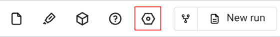

# Project Settings

*The Project Settings panel provides access to project-level configuration, run settings, and project metadata. This panel allows you to manage project properties, configure units, and view project statistics.*

---

## Accessing Project Settings

The Project Settings panel is accessible through:

- The settings icon in the top bar (next to the help icon)

- A dropdown menu appears with options including "Project settings" and "Variable settings"
- Clicking "Project settings" opens the panel on the right side of the interface

---

## Overview

The Project Settings panel is organized into two main tabs:

- **Run settings**: Configuration options for the current simulation run, including units, mesher options, solver version, and run statistics
- **Project details**: Project-level metadata including project name, ID, folder location, tags, description, and project cost

---

## Run Settings Tab

The "Run settings" tab contains configuration options and information specific to the current simulation run:

### Project Information

- **Project Name**: The name of the current project/case
  - Displayed with a document icon
  - Shows the case name for the current run

### Units System

- **Set up button**: Click "Set up" to open a dropdown menu with predefined unit system options:
  - **Set as SI**: Sets units to SI system (m, kg, s, K)
  - **Set as CGS**: Sets units to CGS system (cm, g, s, K)
  - **Set as Imperial**: Sets units to Imperial system (ft, lb, s, F)
- Selecting a unit system applies the corresponding units across all settings in the project

### Mesher Options

- **Geometry AI**: Toggle switch for "Use the Geometry AI surface mesher"

- **Beta mesher**: Toggle switch for "Use the beta version of Mesher for simulation"

### Solver Configuration

- **Solver version**: Dropdown menu to select the Flow360 solver version (e.g., `release-25.8`)
  - Choose from available solver releases
  - Default is the latest stable release

- **Project length unit**: Dropdown menu to specify the length unit for the project. Available options: `m` (meters), `cm` (centimeters), `mm` (millimeters), `ft` (feet), `inch` (inches)

### Run Status and Statistics

> **Note:** The following sections (Run Status and Statistics, and Time Information) are only available when a simulation run has finished.

- **Status**: Displays the current status of the simulation run
  - Shows "Completed" with a green checkmark when the run has finished successfully
  - Other statuses may include "Running", "Queued", "Visualizing", "Failed".

- **Tags**: Option to add tags to the run for organization and filtering
  - Click "+ Add" to add new tags
  - Tags help categorize and search for runs

- **Volume ID**: Unique identifier for the volume mesh used in this run

- **Case cost**: Total FlexCredits consumed by this simulation run

- **Location**: The workspace where the project is stored

### Time Information

- **Total time**: Total duration of the simulation run

- **Time per stage**: Detailed breakdown of time spent in each simulation stage.

- **Creation time**: Timestamp when the case was created

- **Update time**: Timestamp when the case was last modified

---

## Project Details Tab

The "Project details" tab contains project-level metadata and information:

### Project Information

- **Project Name**: The name of the project. Can be edited.

- **Project ID**: Unique identifier for the project. Frequently used through the python API.

### Organization

- **Folder**: The workspace folder where the project is located. Can be expanded or edited to change the project location

- **Tags**: Option to add tags to the project for organization
  - Click "+ Add" to add new tags
  - Tags help categorize and search for projects

- **Description**: Optional text field for project description and notes.

### Project Statistics

- **Project cost**: Total FlexCredits consumed across all runs in this project. Cumulative cost of all simulation runs within the project

- **Solver version**: The solver version with which the project was created.

### Timestamps

- **Creation time**: Timestamp when the project was created

- **Update time**: Timestamp when the project was last modified

---

<h3 style="display:inline-block">❓ Frequently Asked Questions</h3>

- **What's the difference between Run settings and Project details?**  
  > Run settings contain configuration and statistics for the current simulation run, while Project details contain project-level metadata that applies to all runs in the project.

- **Can I change the solver version after a run has completed?**  
  > Yes, you can change the solver version in Run settings, but this will only affect new runs. Completed runs retain their original solver version.

- **How do I change units for my entire project?**  
  > Use the "Set up" button in the Units system section of Run settings to change all units at once.

- **What are FlexCredits?**  
  > FlexCredits are the computational currency used in Flow360. Project cost shows the total credits consumed across all runs in the project.

- **Can I edit the project name?**  
  > Project name can typically be edited in the Project details tab or through the project tree interface.

- **What is the difference between case cost and project cost?**  
  > Case cost (in Run settings) shows the cost for a single simulation run, while project cost (in Project details) shows the cumulative cost of all runs in the project.

- **Why are run settings sometimes locked?**  
  > When viewing a completed or running case, you are in view-only mode and cannot modify settings. To edit settings, you need to start a new run setup by clicking "New run" or "Fork" in the top bar.

