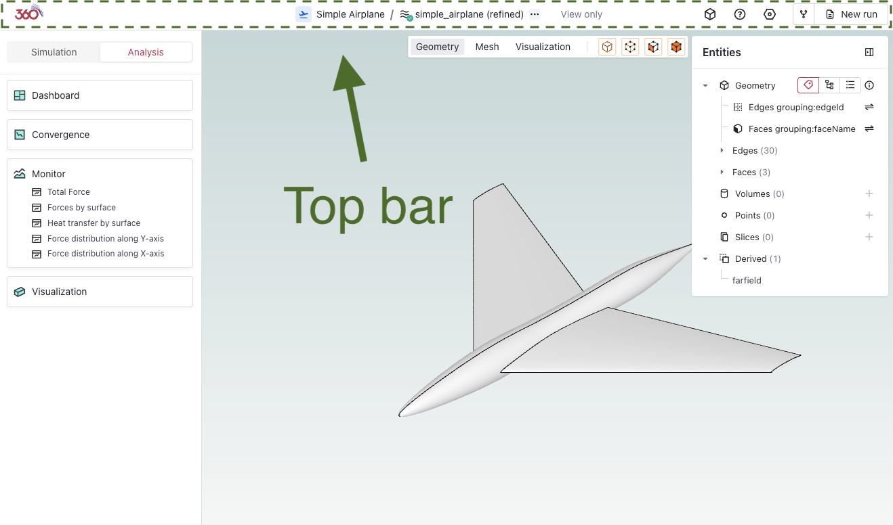
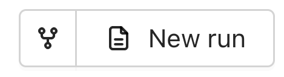

# Top Bar

The Flow360 GUI top bar provides essential navigation and project management functionality, enabling efficient workflow control and access to key features.

---

## 📋 **Available Components** (from left to right)

| **Component** | **Icon** | **Description** |
|--------------|----------|-----------------|
| `Flow360 logo` |  | Return to Flow360 Dashboard |
| [`Project tree`](./01.project-tree/README.md) |  | Hierarchical view of project components, for more details, refer to this [page](./01.project-tree/) |
| `More` |  | Click the three dots to export / import settings |
| `View only` |  | Appears when you're accessing the project in view only mode |
| `Assets` |  | Access project assets and resources |
| `Help` |  | Access documentation and support |
| `Project settings` |  | Configure project parameters |
| `Fork/New run` |  | Create project variants |

---

## 🔍 **Detailed Descriptions**

### Flow360 logo

*Quick access to return to the Flow360 Dashboard, maintaining efficient workflow navigation.*

### Project tree

*Hierarchical organization of project components, providing structured access to simulation elements.*

- Expandable/collapsible structure
- Visual status indicators
- Direct component access

Details about project tree can be found [here](./01.project-tree/README.md).

### More

*Additional project management options accessible via a three-dot menu.*

- Import/Export simulation settings
- Import/Export viewpoints

### View only

*Notification that the project is currently being viewed in view-only mode states for project examination.*

- simulation parameters cannot be changed in this mode
- to exit, click on new run or select a component from the project tree

### Assets

*Central repository for project-related resources and files.*

- Information about each asset
- Downloadable files list for each asset

### Help

*Access to documentation, support resources, and guidance materials.*

### Project settings

*Configuration interface for project-specific parameters. Includes run settings and project details.*

### Fork/New run

*Create an extension of a case based on current configuration. More information can be found in the [Forking section](./01.project-tree/README.md#️-forking) of the [Project tree](./01.project-tree/README.md) documentation.*

---

<h3 style="display:inline-block"> 💡 Tips</h3>

- Use keyboard shortcuts for frequent operations
- Regularly save project settings
- Monitor view-only status when collaborating
- Utilize project tree for quick navigation
- Keep asset organization structured

---

<h3 style="display:inline-block"> ❓ Frequently Asked Questions</h3>

- **How do I return to the dashboard?**
  > Click the left-most navigation icon in the top bar.

- **Can I customize the project tree view?**
  > Yes, use the project tree settings to adjust the display and organization of components.

- **What's the difference between Fork and New Run?**
  > Fork creates a new project variant with modifiable settings, while New Run creates another simulation with the same configuration.

- **How do I share view-only access?**
  > Enable view-only mode and share the project URL with collaborators.

