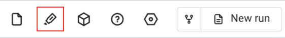

# Probing

*Probing allows you to probe the location of any point on an imported geometry. This tool is useful for inspecting specific locations, measuring distances, and verifying geometry coordinates.*

---

## **Overview**

Probing provides a way to interactively select and inspect point locations on geometry loaded in the viewer. When you click on a point, its location is temporarily stored until a new point is clicked, allowing you to quickly check coordinates at different locations.

---

## **Accessing Probing**

The Probing tool is available when:

- Geometry is loaded in the viewer
- The probe tool icon appears in the viewer toolbar
- Clicking the probe icon opens the "Probe location" panel

---

## **Operating Modes**

Probing offers two modes of operation:

### **Selection in Viewer**

In this mode, you can directly click on any point in the 3D viewer to probe its location.

- Click anywhere on the geometry surface in the viewer
- The location coordinates are automatically displayed
- The probed location is highlighted or marked in the viewer
- Clicking a new point replaces the previous probed location

### **Location Specification**

In this mode, you can manually specify the coordinates of the point you want to probe.

- Enter the X, Y, and Z coordinates directly
- The specified location is displayed in the viewer
- Useful for probing exact locations or locations that may be difficult to click

---

## **Interface Elements**

The Probing interface appears as a pop-up panel with the following elements:

- **Location field**: Labeled "Location -" with an edit icon, displays or allows input of the X, Y, Z coordinates
- **Entity Name field**: Labeled "Entity Name -", shows the entity or surface name at the probed location