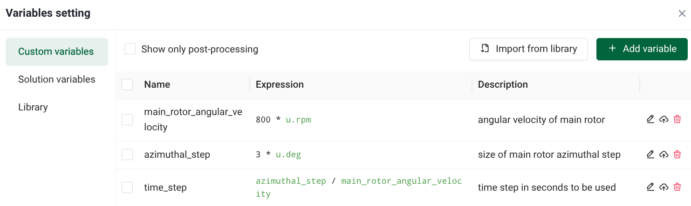
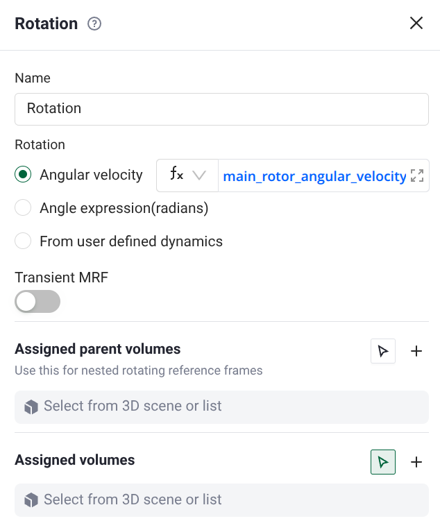
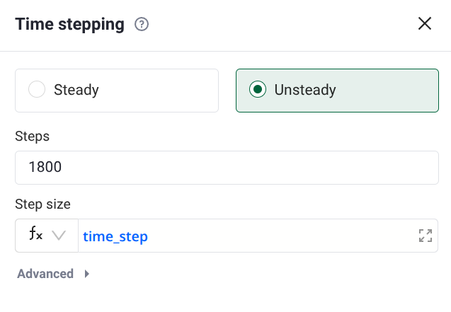

# Variable Settings

*The Variable Settings tab allows you to create and manage user-defined variables for use in simulations and post-processing. Variables can be defined using mathematical expressions involving constants, units, and other variables.*

---

## **Accessing Variable Settings**

---

## **Variable Types**

The Variable Settings tool organizes variables into different categories through a tabbed interface:

### **Custom Variables**

The "Custom variables" tab displays user-defined variables in a table format with columns:

- **Name**: The variable name (e.g., `velocity_ref`, `rho`, `q_inf`)
- **Expression**: The mathematical expression defining the variable (e.g., `100*u.m/u.s`, `1.225*u.kg/u.m**3`, `0.5*rho*velocity_ref**2`)
- **Description**: Optional description field for documenting the variable

#### **Simulation Parameter**

Variables that can be used as inputs to the simulation, such as boundary condition values.

#### **Post-processing**

Variables defined for output and visualization purposes.

### **Solution Variables**

Contains pre-computed quantities from the solver organized into volume mesh and surface mesh variables. Volume mesh variables include flow field quantities (density, velocity, pressure, temperature), derived quantities (Mach number, vorticity, Q-criterion, entropy), turbulence quantities, gradient fields, and geometric quantities. Surface mesh variables include skin friction, heat flux, heat transfer coefficients, surface forces, wall shear stress, and surface geometry.

---

## **Library**

The library allows you to pre-define variables which can be later imported to the custom variable panel.

---

## **Creating Variables**

To create a new variable:

1. Open the Variable Settings tool from the viewer toolbar
2. Navigate to the "Custom variables" tab or "Library" tab
3. Click the green "+ Add variable" button located to the right of the variables table
4. Enter the variable name in the "Name" column
5. Define the expression in the "Expression" box using:
   - Constants with units (e.g., `100*u.m/u.s`)
   - Mathematical operations (`+`, `-`, `*`, `/`, `**`)
   - References to other variables
   - Solution variables
6. Optionally add a description in the "Description" box

### **Importing a Variables from Library**

To import solution variables into custom variables you can either:

1. Navigate to the "Custom Variables" tab and select "Import from Library" **or** navigate directly to the "Library" tab.

3. This brings you to the "Library" page, select the variables you want to import and then click on "Import to custom variables". The variables will appear in the "Custom Variables" tab.

---

## **Variable Expression Syntax**

Variables support a rich expression syntax:

- **Units**: Access units through the `u` namespace (e.g., `u.m`, `u.s`, `u.kg`, `u.Pa`)
- **Mathematical operations**: Standard arithmetic and functions
- **Variable references**: Reference other custom variables by name
- **Solution variables**: Access solver quantities

---

## **Example Variables**

Compute a dimensional time step for a rotor simulation with the following variables:

then you can set the rotational speed with:

and the time step with:

---

<h3 style="display:inline-block">❓ Frequently Asked Questions</h3>

- **Where can I use custom variables?**  
  > Custom variables can be used in boundary conditions, initial conditions, output expressions, and other simulation parameters that accept expressions.

- **What happens if I reference a variable that doesn't exist?**  
  > Flow360 will display an error indicating that the variable is not defined. Make sure to define variables before referencing them.

- **Can I import variables from a library?**  
  > The Variable Settings tool includes a library feature that allows you to select and import pre-defined solution variables into your custom variables.

- **How do I delete a variable?**  
  > Variables can be removed through the Variable Settings interface. Note that variables referenced elsewhere may need to be updated first.

