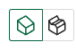

# Volume Mesh Diagnostics

*The Volume Mesh Diagnostics tool provides comprehensive analysis capabilities for assessing the quality of volume meshes through automatically generated slices. This tool helps identify mesh quality issues in the 3D volume mesh.*

---

## **Overview**

The Volume Mesh Diagnostics tool opens a dedicated panel that allows you to inspect volume mesh quality by analyzing cross-sectional slices through the mesh. When a volume mesh is loaded, this tool becomes available to help:

- Identify poor quality volume elements
- Inspect mesh quality at different locations
- Understand mesh characteristics throughout the domain
- Diagnose potential issues that could affect simulation accuracy

---

## **Accessing Volume Mesh Diagnostics**

The Volume Mesh Diagnostics tool is available when:

- A volume mesh is loaded in the viewer
- The "Volume Mesh Diagnostic" button appears in the viewer toolbar (below the file path in the top bar)

- Clicking the button opens the "Volume Mesh Diagnostic" interface

---

## **Diagnostic Features**

### **Quality Metrics**

The automatically generated slices allow you to inspect the quality of the volume mesh cells visualized in each slice. You can analyze the following mesh quality metrics for the cells displayed:

- **Aspect Ratio**: Ratio of longest to shortest edge of the volume cells
- **Minimum Edge Length**: Shortest edge length in the volume cells
- **Maximum Edge Length**: Longest edge length in the volume cells
- **Volume**: Volume of the individual cells in the slice
- **Maximum Aspect Ratio**: Largest aspect ratio found in the slice

These metrics help you identify cells with poor quality, such as highly stretched elements (high aspect ratio), cells with very small edges (minimum edge length), or cells with unusual volumes that may affect simulation accuracy.

### **Automatic Slice Generation**

The tool automatically creates slices for analysis:

- **Worst-quality slices**: Slices are automatically generated based on worst aspect ratio and minimum edge length locations
- **Default slices**: Several default slices are automatically created close to bodies in the domain
- **Slice orientation**: Slices are created along x-normal, y-normal, and z-normal directions

### **Slice Management**

The diagnosis settings panel provides comprehensive slice management:

- **Slices list section**: View and manage all available slices in the "Slices list" section
- **Search functionality**: Use the "Search" input field to filter slices by name or criteria
- **Visibility toggle**: Eye icon next to each slice entry allows you to show or hide individual slices in the viewer
- **Slice switching**: "Switch to crinkled" button toggles between crinkled (showing actual mesh element boundaries) and smooth slice visualization

- **Slice information**: Hover over slice entries to see tooltips with detailed information:
  - Example: "Worst-quality x-normal slice based on smallest minimum edge length in zone farfield"
  - Example: "Worst-quality x-normal slice based on maximum aspect ratio in zone farfield"
