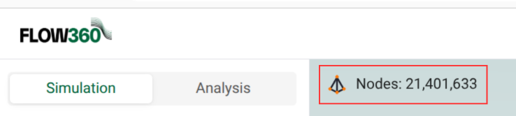

# Mesh Statistics Panel

*The Mesh Statistics Panel provides detailed numerical information about the mesh, including element counts, node information, and boundary statistics. This panel is accessible directly from the viewer and provides a comprehensive overview of mesh characteristics.*

---

## **Accessing the Mesh Statistics Panel**

The Mesh Statistics Panel is accessed by:

- Clicking on the node count display in the viewer

- The panel opens in the main content area, replacing the 3D viewer
- The panel displays comprehensive mesh statistics organized into sections

---

## **Metrics Section**

The panel displays comprehensive mesh information organized under the "Metrics" heading:

### **Mesh Statistics**

Overall mesh information displayed in a structured list format:

- **Nodes**: Total number of nodes in the mesh
- **Triangles**: Number of triangular surface elements
- **Prisms**: Number of prismatic volume elements
- **Quadrilaterals**: Number of quadrilateral surface elements
- **Pyramids**: Number of pyramid volume elements
- **Tetrahedrons**: Number of tetrahedral volume elements
- **Hexahedrons**: Number of hexahedral volume elements

Each statistic is displayed with its numerical value, providing a quick overview of mesh composition.

### **Boundary Section**

For surface meshes, the "Boundary" section shows:

- **Face list**: Faces are listed in the format `volume_zone_name/surface_name(NUMBER)` where:
  - `volume_zone_name` indicates the volume zone identifier (e.g., `fluid`)
  - `surface_name` indicates the surface identifier (e.g., `body00001_face00001`)
  - `(NUMBER)` indicates the element count for that face.
- **Expandable entries**: Each boundary face entry has a right-pointing triangle indicating it can be expanded to show detailed statistics tables

#### **Boundary Statistics Table**

When you expand a boundary face entry, a detailed statistics table is displayed with the following columns:

- **Title**: The name of the mesh quality metric (e.g., `area`, `areaRatio`, `aspectRatio`, `firstLayerThickness`)
- **Arithmetic Mean**: The average value of the metric across all elements in the boundary face
- **Max**: The maximum value observed for the metric
- **Max Element Types**: The type(s) of mesh elements associated with the maximum value (e.g., `Triangle`, `Node`)
- **Max Location**: The 3D coordinates (X, Y, Z) where the maximum value occurs, with a copy icon to copy coordinates
- **min**: The minimum value observed for the metric
- **Min Element Types**: The type(s) of mesh elements associated with the minimum value
- **Min Location**: The 3D coordinates (X, Y, Z) where the minimum value occurs, with a copy icon to copy coordinates

### **Volumetric Section**

For volume meshes, the "Volumetric" section shows:

- **Zone list**: Zones are listed in the format `zone_name (ELEMENT_COUNT)` (e.g., `fluid (25,092,608)`)
- **Expandable zones**: Each volume zone entry has a right-pointing triangle indicating it can be expanded to show detailed statistics tables

#### **Volumetric Statistics Table**

When you expand a volume zone entry, a detailed statistics table is displayed with the following columns:

- **Title**: The name of the mesh quality metric (e.g., `aspectRatio`, `volume`)
- **Arithmetic Mean**: The average value of the metric across all elements in the volume zone
- **Max**: The maximum value observed for the metric
- **Max Element Types**: The type(s) of mesh elements associated with the maximum value (e.g., `Prism`, `Tetrahedron`)
- **Max Location**: The 3D coordinates (X, Y, Z) where the maximum value occurs, with a copy icon to copy coordinates
- **min**: The minimum value observed for the metric
- **Min Element Types**: The type(s) of mesh elements associated with the minimum value
- **Min Location**: The 3D coordinates (X, Y, Z) where the minimum value occurs, with a copy icon to copy coordinates

### **Visualization Section**

The panel also includes a "Visualization" section that shows mesh screenshots.
